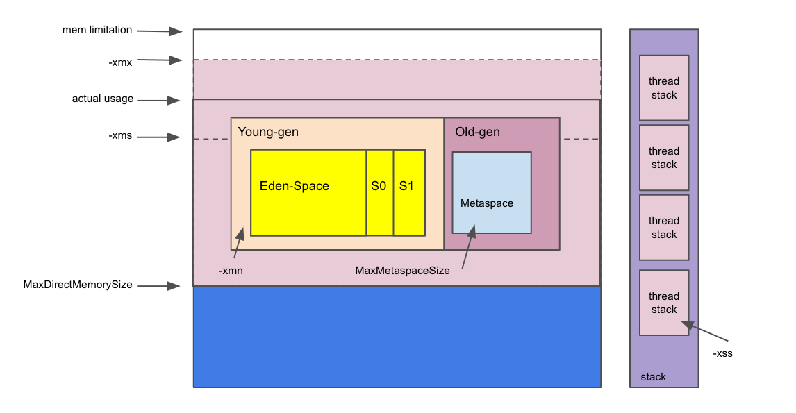

Java Bytecode Analysis
====
# Bytecode reading


## Source Code

```Java
public class Hello {
	public static void main(String[] args) {
		boolean a = false;
		int b = 10;
		int c = 20;
		int d = b + c;
		int e = b - c;
		float f = b / c;
		int g = b * c;
		int h = 10;
		if (d > e) {
			h = 40;
		}
		int sum = 0;
		for (int i = 0; i < h; i ++) {
			sum += i;
		}
	}
}
```

## Bytecode

```
Classfile /Users/songzuquan/code/geek-time/co01/Hello.class
  Last modified Oct 15, 2020; size 456 bytes
  MD5 checksum 9792e767888785fce758d7ea37473b85
  Compiled from "Hello.java"
public class Hello
  minor version: 0
  major version: 52  // 版本号8 (Java version 8)
  flags: ACC_PUBLIC, ACC_SUPER 
Constant pool:
   #1 = Methodref          #3.#14         // java/lang/Object."<init>":()V
   #2 = Class              #15            // Hello
   #3 = Class              #16            // java/lang/Object
   #4 = Utf8               <init>
   #5 = Utf8               ()V
   #6 = Utf8               Code
   #7 = Utf8               LineNumberTable
   #8 = Utf8               main
   #9 = Utf8               ([Ljava/lang/String;)V
  #10 = Utf8               StackMapTable
  #11 = Class              #17            // "[Ljava/lang/String;"
  #12 = Utf8               SourceFile
  #13 = Utf8               Hello.java
  #14 = NameAndType        #4:#5          // "<init>":()V
  #15 = Utf8               Hello
  #16 = Utf8               java/lang/Object
  #17 = Utf8               [Ljava/lang/String;
{
  public Hello();  
    descriptor: ()V		// 默认构造函数(Default constructor)
    flags: ACC_PUBLIC
    Code:
      stack=1, locals=1, args_size=1					// stack大小为1，local变量大小为1，参数大小为1(this) 
         0: aload_0														// 加载this引用
         1: invokespecial #1                  // 调用父类Object构造方法 (Method java/lang/Object."<init>":()V)
         4: return
      LineNumberTable:
        line 2: 0

  public static void main(java.lang.String[]);
    descriptor: ([Ljava/lang/String;)V
    flags: ACC_PUBLIC, ACC_STATIC
    Code:
      stack=2, locals=11, args_size=1
         0: iconst_0																	// 加载0值到栈上
         1: istore_1																	// 把栈顶的int值(0)存储到局部变量表1位置上
         2: bipush        10													// push 10到栈上
         4: istore_2																	// 把栈顶的int值(10)存储到局部变量表2位置上
         5: bipush        20													// push 20到栈上
         7: istore_3																	// 把栈顶的int值(20)存储到局部变量表3位置上
         8: iload_2																		// 加载2位置值(10)到栈上
         9: iload_3																		// 加载3位置值(20)到栈上
        10: iadd																			// add 10, 20，将结果（30）push到栈上
        11: istore        4														// 把栈顶的int值(30)存储到局部变量表3位置上
        13: iload_2																		// 加载2位置值(10)到栈上
        14: iload_3																		// 加载3位置值(20)到栈上
        15: isub																			// sub 10, 20，将结果（-10）push到栈上
        16: istore        5 													// 把栈顶的int值(-10)存储到局部变量表5位置上
        18: iload_2																		// 加载2位置值(10)到栈上
        19: iload_3																		// 加载3位置值(20)到栈上
        20: idiv																			// div 10, 20，将结果（0.5）push到栈上
        21: i2f																				// 将栈顶的int类型转成float类型
        22: fstore        6 													// 把栈顶的float值(0.5)存储到局部变量表6位置上
        24: iload_2																		// 加载2位置值(10)到栈上
        25: iload_3																		// 加载3位置值(20)到栈上
        26: imul																			// mul 10, 20，将结果（200）push到栈上
        27: istore        7 													// 把栈顶的int值(200)存储到局部变量表7位置上
        29: bipush        10 													// push 10到栈上
        31: istore        8														// 把栈顶的int值(10)存储到局部变量表8位置上
        33: iload         4														// 加载4位置值(30)到栈上
        35: iload         5														// 加载5位置值(-10)到栈上
        37: if_icmple     44													// 将栈顶的两个4byte比较大小（30， -10），30 <= -10，jump到44
        40: bipush        40													// push 40到栈上
        42: istore        8 													// 把栈顶的int值(40)存储到局部变量表8位置上
        44: iconst_0																	// 加载0值到栈上
        45: istore        9														// 把栈顶的int值(0)存储到局部变量表9位置上
        47: iconst_0																	// 加载0值到栈上
        48: istore        10 													// 把栈顶的int值(0)存储到局部变量表10位置上
        50: iload         10 													// 加载10位置值(0)到栈上
        52: iload         8 													// 加载8位置值(40)到栈上
        54: if_icmpge     70													// 将栈顶的两个4byte比较大小（位置10，位置8），如果位置10 >= 位置8，jump到70
        57: iload         9 													// 加载9位置值(40)到栈上
        59: iload         10 													// 加载10位置值(0)到栈上
        61: iadd						 													// add 栈顶的两个值，将结果push到栈上
        62: istore        9														// 把栈顶的int值存储到局部变量表9位置上
        64: iinc          10, 1 											// 把局部变量表10位置上的值+1
        67: goto          50 													// 跳转到50
        70: return
      LineNumberTable:
        line 5: 0
        line 6: 2
        line 7: 5
        line 8: 8
        line 9: 13
        line 10: 18
        line 11: 24
        line 12: 29
        line 13: 33
        line 14: 40
        line 16: 44
        line 17: 47
        line 18: 57
        line 17: 64
        line 20: 70
      StackMapTable: number_of_entries = 3
        frame_type = 255 /* full_frame */
          offset_delta = 44
          locals = [ class "[Ljava/lang/String;", int, int, int, int, int, float, int, int ]
          stack = []
        frame_type = 253 /* append */
          offset_delta = 5
          locals = [ int, int ]
        frame_type = 250 /* chop */
          offset_delta = 19
}
SourceFile: "Hello.java"
```

# Classloader Operation

```java
import java.io.*;
import java.lang.reflect.InvocationTargetException;
import java.lang.reflect.Method;
import java.nio.file.Files;

public class HelloClassloader extends ClassLoader {
	public static void main(String[] args) {
        try {
            Object obj = new HelloClassloader().findClassByFileName("Hello/Hello.xlass", "Hello").newInstance();
            Method method = obj.getClass().getMethod("hello");
            method.invoke(obj);
        } catch (InstantiationException | IllegalAccessException | IOException | NoSuchMethodException | InvocationTargetException e) {
            e.printStackTrace();
        }
    }

    @Override
    protected Class<?> findClass(String name) throws ClassNotFoundException {
        return super.findClass(name);
    }

    private Class<?> findClassByFileName(String filePath, String className) throws IOException {
        byte[] bytes = Files.readAllBytes(new File(filePath).toPath());
        bytes = this.decode(bytes);
        return defineClass(className, bytes, 0, bytes.length);
    }

    private byte[] decode(byte[] bytes) {
	    byte[] newBytes = new byte[bytes.length];
	    for(int i = 0; i < bytes.length; i ++) {
            newBytes[i] = (byte) ~bytes[i];
        }
        return newBytes;
    }
}
```

# JVM Parameter Visualization





